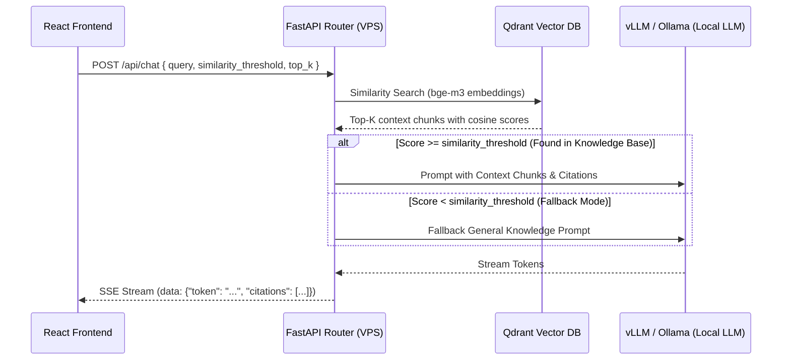

# VPS Backend API Specification & Contract

This document provides the exact contract for developing the backend (using FastAPI, Flask, Express, LangChain, or LlamaIndex) to connect with the **Arena RAG Frontend**.

---

## 1. Overview & Architecture

The frontend communicates with your VPS backend using standard **REST endpoints** and **Server-Sent Events (SSE)** for real-time streaming tokens.



---

## 2. API Endpoints

### A. Chat Completion (Streaming)
* **Endpoint**: `POST /api/chat`
* **Content-Type**: `application/json`
* **Response Type**: `text/event-stream`

#### Request Body
```json
{
  "query": "What is our company annual leave policy?",
  "session_id": "session-12345",
  "model": "Qwen 2.5 7B-Instruct",
  "top_k": 4,
  "similarity_threshold": 0.65,
  "system_prompt": "You are an intelligent RAG assistant. Answer strictly based on the provided context.",
  "temperature": 0.2
}
```

#### SSE Stream Events (Response)
Your backend must yield lines starting with `data: `:

1. **Token chunks**:
```text
data: {"token": "According "}
data: {"token": "to our "}
data: {"token": "HR Policy "}
data: {"token": "[[1]], ..."}
```

2. **Metadata & Citations (sent at start or end of stream)**:
```text
data: {
  "is_fallback": false,
  "similarity": 0.93,
  "citations": [
    {
      "id": "cit-1",
      "docId": "doc-1",
      "docName": "Company_HR_Policies_2025.pdf",
      "chunkId": 14,
      "score": 0.93,
      "page": 6,
      "text": "Full-time employees are entitled to 20 business days of paid annual leave per calendar year."
    }
  ]
}
```

3. **Stream Termination**:
```text
data: [DONE]
```

---

### B. List Documents
* **Endpoint**: `GET /api/documents`
* **Response**: `application/json`

```json
[
  {
    "id": "doc-1",
    "name": "Company_HR_Policies_2025.pdf",
    "size": "2.4 MB",
    "chunksCount": 38,
    "uploadedAt": "Today at 10:14 AM",
    "status": "ready",
    "type": "pdf"
  }
]
```

---

### C. Upload & Index Document
* **Endpoint**: `POST /api/documents/upload`
* **Content-Type**: `multipart/form-data`
* **Form Field**: `file` (Binary file)
* **Response**: `application/json`

```json
{
  "id": "doc-1725450000",
  "name": "sales_q3.pdf",
  "size": "1.8 MB",
  "chunksCount": 24,
  "uploadedAt": "Just now",
  "status": "ready",
  "type": "pdf"
}
```

---

### D. Delete Document
* **Endpoint**: `DELETE /api/documents/{doc_id}`
* **Response**: `{"status": "deleted", "id": "doc-1"}`

---

## 3. Ready-to-use FastAPI Backend Template

You can hand this exact snippet to your other model to generate the complete backend:

```python
from fastapi import FastAPI, UploadFile, File
from fastapi.middleware.cors import CORSMiddleware
from fastapi.responses import StreamingResponse
from pydantic import BaseModel
import json
import asyncio

app = FastAPI(title="Arena RAG Backend")

# Enable CORS for Frontend
app.add_middleware(
    CORSMiddleware,
    allow_origins=["*"],
    allow_credentials=True,
    allow_methods=["*"],
    allow_headers=["*"],
)

class ChatRequest(BaseModel):
    query: str
    session_id: str
    model: str = "Qwen 2.5 7B-Instruct"
    top_k: int = 4
    similarity_threshold: float = 0.65
    system_prompt: str = ""
    temperature: float = 0.2

@app.post("/api/chat")
async def chat_endpoint(req: ChatRequest):
    async def event_generator():
        # 1. Search Qdrant / Vector DB
        # 2. Compare similarity score with req.similarity_threshold
        # 3. If score >= req.similarity_threshold -> Augmented prompt
        #    Else -> Fallback prompt (General AI knowledge)
        
        # Stream response
        dummy_tokens = ["This ", "is ", "a ", "streamed ", "RAG ", "response."]
        for tok in dummy_tokens:
            yield f"data: {json.dumps({'token': tok})}\n\n"
            await asyncio.sleep(0.05)
            
        yield f"data: {json.dumps({'citations': [], 'is_fallback': False, 'similarity': 0.9})}\n\n"
        yield "data: [DONE]\n\n"

    return StreamingResponse(event_generator(), media_type="text/event-stream")

@app.get("/api/documents")
async def get_documents():
    return []

@app.post("/api/documents/upload")
async def upload_document(file: UploadFile = File(...)):
    # 1. Save file to disk
    # 2. Extract text (pypdf, pdfplumber, etc.)
    # 3. Chunk text (500 tokens, 50 overlap)
    # 4. Generate embeddings (BAAI/bge-m3)
    # 5. Insert to Qdrant
    return {
        "id": f"doc-{file.filename}",
        "name": file.filename,
        "size": "1.2 MB",
        "chunksCount": 12,
        "uploadedAt": "Just now",
        "status": "ready",
        "type": "pdf"
    }

if __name__ == "__main__":
    import uvicorn
    uvicorn.run("main:app", host="0.0.0.0", port=8000, reload=True)
```
